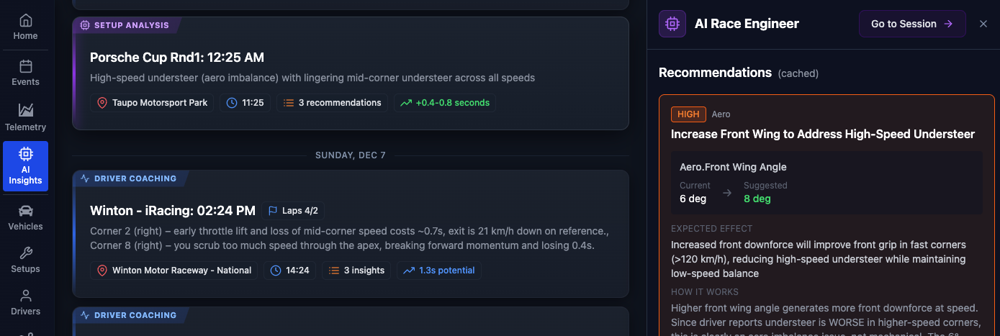
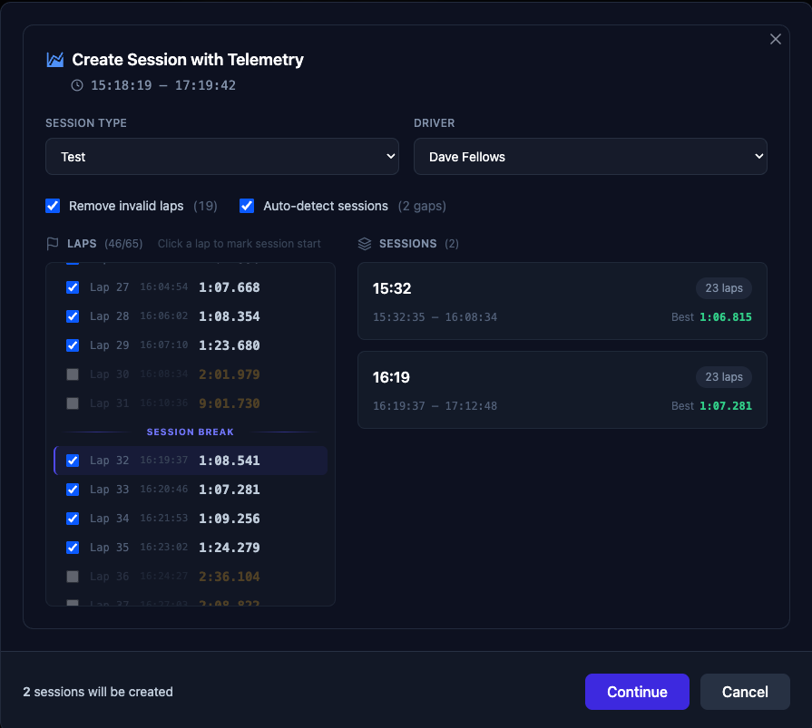

## Highlights

This release brings major improvements to vehicle management with the new Vehicle Profiles system, iRacing telemetry support, enhanced AI coaching with visual track map integration, and significant telemetry import improvements.

Mobile app will be available for iOS soon!

## New Features

### iRacing Telemetry Support

LapLogic now supports iRacing telemetry files! Import your .ibt files directly and analyze your sim racing data:

- Works with all LapLogic features including AI coaching and lap comparison

### Vehicle Profiles

A complete overhaul of how vehicles are managed in LapLogic. Vehicles now have dedicated profiles based on their type, with setup parameters tailored to each category:

- **Cars**: GT3, GT Coupe, Hatchback, LMP, Formula, and more
- **Motorbikes**: Full support for motorcycle setup parameters including suspension geometry, chassis settings, and electronics

Each vehicle type has its own setup schema, so you'll only see the parameters that are relevant to your vehicle.

### AI Insights Page

A new page that lists all your AI Setup and Coaching recommendations in one place. 

### Track Map Corner Detection

Corners are now automatically detected and displayed on the track map (checkbox in map popout window), giving you visual reference points for your racing line analysis.

### Show on Track Map

AI Driver Coaching corner recommendations can now be visualized directly on the track map. When the AI suggests improvements for specific corners, click "Show on Map" to see to the corner it's referring to.

### Track Map Screenshots for AI

The AI now receives a screenshot of the track map with detected corners and your racing lines when analyzing your driving. This gives the AI more visual context, resulting in more accurate and specific feedback.

## Improvements

### Telemetry Import

- **Automatic Session Splitting**: When importing telemetry files that contain multiple sessions (e.g., practice followed by qualifying), LapLogic now automatically detects and splits them into separate sessions
- **Better Memory Management**: Improved handling of large telemetry files to prevent memory issues during import
- **Create Tracks on Import**: If a track doesn't exist in your database, LapLogic can now create it automatically during telemetry import

